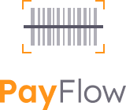
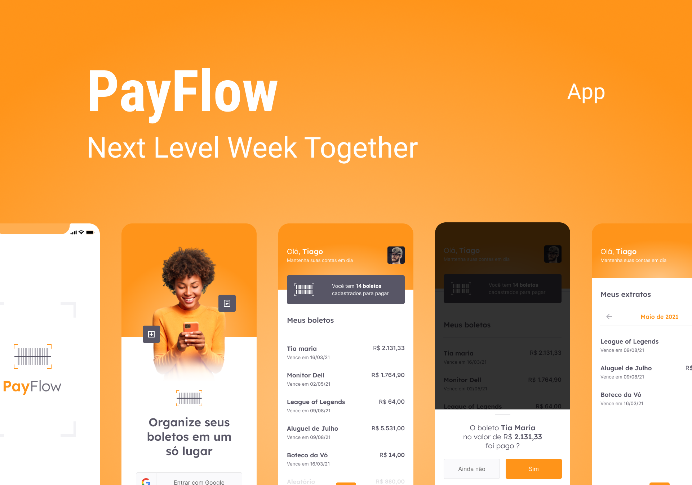
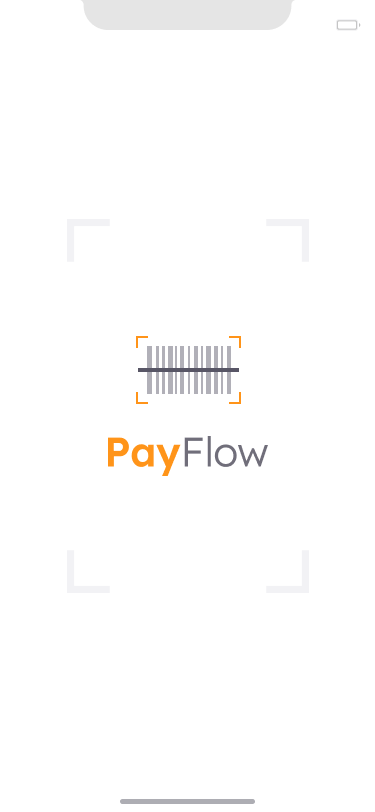
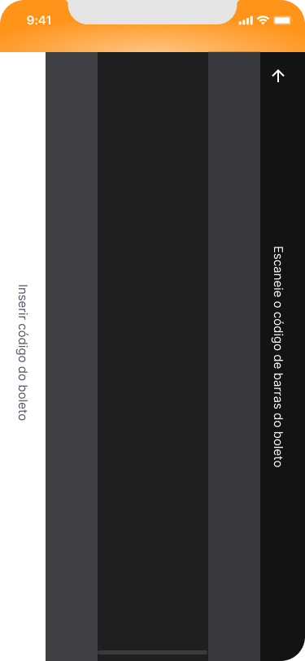
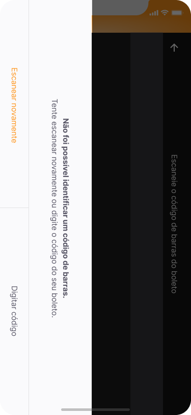
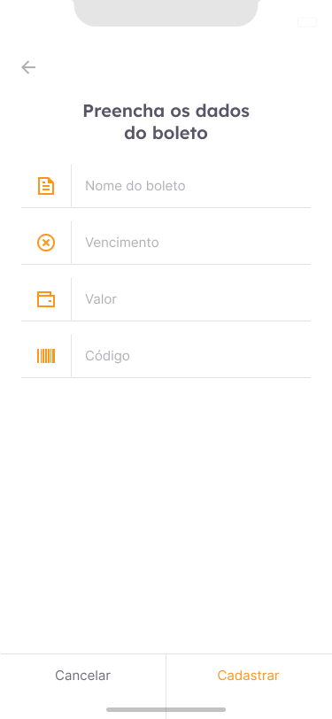
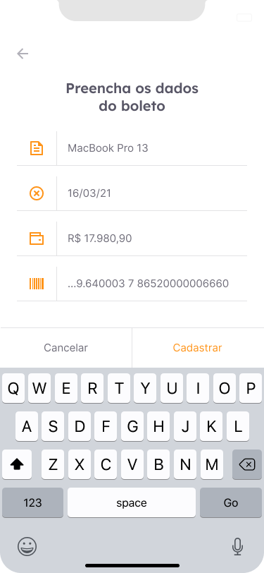

<h1 align="center">
  
</h1>

<p align="center">
  
  
  
  <a href="https://github.com/pabloxt14/payflow/commits/master">
    
  </a>
  
  <a href="https://github.com/pabloxt14/payflow/stargazers">
    
  </a>
</p>

<p>
  
</p>

<!-- <h4 align="center"> 
	🚀 Aplicação finalizada 🚀
</h4> -->

<p align="center">
 <a href="#-about">About</a> | 
 <a href="#-deploy">Deploy</a> | 
 <a href="#-layout">Layout</a> | 
 <a href="#-setup">Setup</a> | 
 <a href="#-technologies">Technologies</a> | 
 <a href="#-license">License</a>
</p>

## 💻 About

O **Payflow** é um aplicativo mobile feito em Flutter para o controle e organização de boletos e pagamentos, permitindo ao usuário cadastrar suas cobranças de forma simples e prática, podendo escanear o código de barras ou digitar manualmente. O objetivo é facilitar a organização financeira pessoal, ajudando a lembrar dos vencimentos e possibilitando o acompanhamento dos pagamentos realizados.

Principais recursos:
- Cadastro, remoção e visualização de boletos
- Leitura de código de barras com a câmera ou foto da galeria
- Organização de pagamentos (a pagar e pagos)
- Armazenamento local usando Shared Preferences
- Login Social com Google
- Interface moderna e intuitiva


## 🔗 Deploy

- Download do APK: [Android](https://github.com/PabloXT14/payflow/releases/download/v1.0.0-beta/payflow-v1.0.0-beta.apk)


## 🎨 Layout

Você pode visualizar o layout base do projeto no [Figma](https://www.figma.com/community/file/991337911070600335/payflow). É necessário ter uma conta no [Figma](https://www.figma.com/) para acessá-lo.

A seguir, uma demonstração das principais telas:

### Splash
<p align="center">
  
</p>

### Login
<p align="center">
  
</p>

### Home
<p align="center">
  
</p>

### Edit Boleto Modal
<p align="center">
  
</p>

### Extract
<p align="center">
  
</p>

### Scan Bar Code
<p align="center">
  
</p>

### Scan Bar Code Try Again
<p align="center">
  
</p>

### Boleto Form (Empty)
<p align="center">
  
</p>

### Boleto Form (Filled)
<p align="center">
  
</p>


## ⚙ Setup

### 📝 Pré-requisitos

Antes de começar, você precisará ter as seguintes ferramentas instaladas:
- [Git](https://git-scm.com)
- [Flutter](https://flutter.dev/docs/get-started/install)
- [Dart](https://dart.dev/get-dart)

E um editor para trabalhar com o código, como o [VSCode](https://code.visualstudio.com/).

### Clonando e Executando

```bash
# Clone este repositório
$ git clone git@github.com:pabloxt14/payflow.git

# Acesse a pasta do projeto
$ cd payflow

# Instale as dependências
$ flutter pub get

# Configurar projeto no Firebase de acordo com a seguinte documentação (https://firebase.google.com/docs/flutter/setup?hl=pt-br&platform=ios)

# Criar o seu arquivo .env com base no .env.example

# Rode o app (escolha o aparelho/emulador desejado)
$ flutter run --dart-define-from-file=.env
```

> Se necessário, consulte o guia oficial do Flutter para rodar o projeto em diferentes plataformas: [Flutter - Deploy](https://docs.flutter.dev/deployment)

## 🛠 Technologies

O projeto foi desenvolvido com as seguintes tecnologias principais:
- **[Flutter](https://flutter.dev/)**
- **[Dart](https://dart.dev/)**
- **[Firebase](https://firebase.google.com/docs/flutter/setup?hl=pt-br&platform=ios)**
- **[Google Sign In](https://pub.dev/packages/google_sign_in)**
- **[Google ML Kit](https://pub.dev/packages/google_mlkit_barcode_scanning)** (para leitura de boletos)
- **[Shared Preferences](https://pub.dev/packages/shared_preferences)**
- **[Google Fonts](https://pub.dev/packages/google_fonts)**
- **[Camera](https://pub.dev/packages/camera)**
- **[Image Picker](https://pub.dev/packages/image_picker)**
- **[Font Awesome](https://pub.dev/packages/font_awesome_flutter)**
- **[Signals](https://pub.dev/packages/signals)**
- **[Flutter Animate](https://pub.dev/packages/flutter_animate)**
- **[UUID](https://pub.dev/packages/uuid)**
- **[Toastfication](https://pub.dev/packages/toastification)**

> Para mais detalhes das dependências, confira o arquivo [pubspec.yaml](./pubspec.yaml)

## 📝 License

Este projeto está sob a licença MIT. Veja o arquivo [LICENSE](./LICENSE) para mais informações.

<p align="center">
  Feito com 💜 por Pablo Alan 👋🏽 <a href="https://www.linkedin.com/in/pabloalan/" target="_blank">Entre em contato!</a>  
</p>
